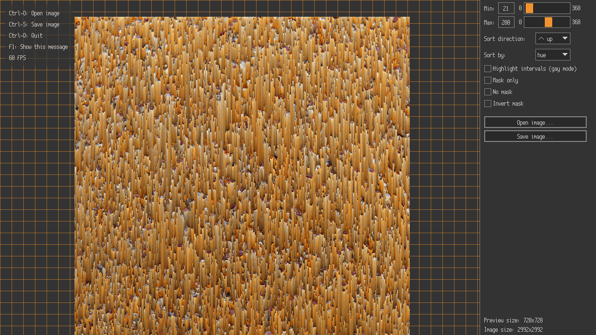

# SoPi: a pixel sorter written in C

---


## Preview



## Usage
Double clicking the executable (equivalent of running without arguments) will launch the gui.<br>
The program also supports command line arguments, for more info run `sopi --help`.


## Building
Compile nob with your compiler of choice.
```
cc -o nob nob.c
```
Use `nob` for all future compilations.<br>

`./nob linux` or `./nob windows` to build on either platform.<br>
`./nob all` to build on all platforms.<br>
If you want to build the program without gui stuff:
```
./nob cli_only
```
>   Note:
> Compilation on Windows requires [MinGW](https://github.com/skeeto/w64devkit/releases).


## Credits
- http://satyarth.me/articles/pixel-sorting/
- https://stackoverflow.com/a/6930407 (rgb to hsv)
- [Raylib](https://github.com/raysan5/raylib) and [Raygui](https://github.com/raysan5/raygui)
- [Aurora](https://xcancel.com/AuroraDrywall) for images in logo
